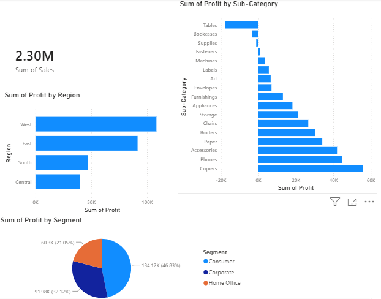

# 📊 TechMart Sales Analysis & Business Intelligence Dashboard

## 📝 Project Overview
This project is an end-to-end data analytics solution designed to uncover hidden business insights from retail sales data. We utilized **Python** for data exploration, cleaning, and root cause analysis, followed by **Microsoft Power BI** to build an interactive dashboard for stakeholders.

## 🎯 Business Questions Answered
1. **Why is the Central region struggling with profitability despite high sales?**
2. **Which customer segment drives the most profit?**
3. **Which specific product sub-categories are causing the biggest financial drains?**

## 📁 Project Structure
```text
├── data/
│   ├── raw/                 # Original unedited data
│   └── cleaned/             # Processed data ready for BI tools
├── images/                  # Exported charts and dashboard screenshots
├── notebooks/
│   └── analysis.ipynb       # Jupyter Notebook containing Python analysis
└── powerbi/
    └── TechMart_Sales_Dashboard.pbix # Interactive Power BI dashboard
```

## 💡 Key Insights & Recommendations
* **The Root Cause in Central Region:** The analysis revealed that the Central region applies exceptionally high discount rates (average **24%**), which destroys its profit margins. **Recommendation:** Cap regional discounts at a maximum of 10-15% to align with the highly profitable West region.
* **Customer Segments:** The **Consumer** segment is the absolute winner, contributing **46.8%** of the total profit. 
* **Bleeding Products:** *Tables* and *Bookcases* are operating at a massive loss, primarily due to flawed discount strategies.

## 📸 Visualizations
### 1. Python Analysis (Customer Segments)


### 2. Power BI Dashboard


## 🛠️ Tools & Technologies Used
* **Python** (Pandas, Matplotlib)
* **Jupyter Notebook**
* **Microsoft Power BI**
